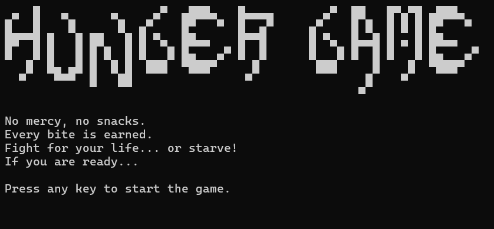

# MiniAdventure

## Introduction
A mini console game built with: 

## Resource
<a href="https://www.youtube.com/watch?v=qAWhGEPMlS8&list=PL-LDQE9x9hLwldZPPGwqXixr-_DfINfxk&index=30">
    Intro to C#: 29 - Making a Fancy Keyboard-Controlled Console Menu
</a>
<a href="https://www.asciiart.eu/">
    ASCII Art Archive
</a>
<a href="https://store.steampowered.com/app/391570/UNDERTALE_Soundtrack/">
    UNDERTALE Soundtrack
</a>